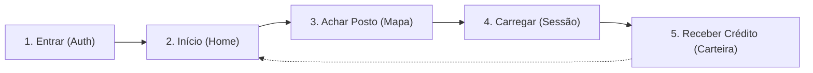

# Auditoria e Redefinição da Jornada do Usuário — Rio Flex

## 1. O Diagnóstico: Por que o app atual está sobrecarregado?

Hoje o front-end possui **8 rotas e telas no menu**:
1. `Início` (Dashboard com KPIs, previsão, recomendações e gráficos)
2. `Planejar` (Formulário com horário de saída, horários de pico e comparação)
3. `Mapa` (Visualização geográfica + busca estilo Uber)
4. `Monitoramento` (Dois gráficos analíticos de gasto ao longo do tempo e preço vs região)
5. `Recompensas` (Campanhas ativas, CO2 evitado, kWh deslocados)
6. `Histórico` (Tabela com todas as recargas)
7. `Meus Recursos / Assets` (Futuro Solar, Bateria, V2G)
8. `Perfil` (Dados pessoais, configurações de score, cartão simulado)

### Principais Problemas Identificados:
- **Excesso de ruído cognitivo**: Um motorista com 20% de bateria no carro precisa de **ação imediata**, não de gráficos semanais de Recharts.
- **Duplicação de decisões**: O motorista decide onde carregar no *Início*, no *Planejar* ou no *Mapa*? Há 3 telas competindo pelo mesmo objetivo.
- **Métricas corporativas expostas cedo demais**: Termos como VPP, CO2 evitado e curvas de flexibilidade interessam à distribuidora de energia, mas o motorista quer apenas duas coisas: **carregar rápido e pagar mais barato**.

---

## 2. A Nova Jornada Simplificada

Eliminando todas as distrações, o aplicativo opera em torno de um fluxo direto e acolhedor:

---

### Passo 1: Entrar (Auth & Setup Mínimo)
> **Objetivo**: Colocar o usuário dentro do app em menos de 15 segundos.

* **O que a tela tem:**
  * Login social direto (Google, Apple ou E-mail/Senha simples).
  * Pergunta única de configuração: **"Qual é o seu carro?"**
    * Seleção rápida de modelos comuns no Rio: *BYD Dolphin / Mini*, *GWM Ora 03*, *Volvo EX30*, *Renault Kwid E-Tech*.
  * O app já memoriza a capacidade da bateria (ex: 44,9 kWh) e tipo de plugue (CCS2).
* **O que sai:**
  * Telas longas de formulário, cadastro de cartões falsos obrigatórios, telas institucionais cheias de texto.

---

### Passo 2: Início (Home `/app`)
> **Objetivo**: A primeira coisa visível é a **Previsão de Pico e Oferta de Energia**, sem dados simulados de telemetria do carro.

* **Estrutura:**
  1. **Previsão de Pico & Oferta de Energia (24h)**:
     * **Janela de Alta Oferta Solar (10h às 16h)**: Abundância de geração renovável (+12 GW solar no SIN), tarifas reduzidas e bônus de flexibilidade ativo (+ R$ 4,50).
     * **Janela de Pico Crítico da Rede (18h às 21h)**: Sobrecarga da rede (80,6 GW), ativação de térmicas fósseis caras. Recomendação clara: *Evite Carregar*.
     * **Gráfico Interativo das 24 Horas**: Barras codificadas por cor (Verde = Solar, Vermelho = Pico, Escuro = Normal) com inspeção hora a hora ao toque.
  2. **Card de Oportunidade VPP do Momento**:
     * Posto recomendado: **COPPE / UFRJ Eletroposto Solar** (4 vagas livres · Plugue CCS2 · + R$ 4,50 em bônus).
     * Botão direto: *"Ver no Mapa"* ou *"Iniciar Recarga"*.
  3. **Ações Rápidas**:
     * 🗺️ **Mapa de Postos**: 449 carregadores no RJ.
     * ⚡ **Sessão Ativa**: medidor em tempo real.
     * 🎁 **Minha Carteira**: saldo de créditos acumulados.
     * 👤 **Meu Perfil**: preferências e conta.
  4. **Seu Desempenho**:
     * Créditos disponíveis (R$ 22,40), Economia no mês (R$ 142,50) e cargas inteligentes (6 sessões).

---

### Passo 3: Achar Posto de Carga (Mapa Estilo Uber `/app/map`)
> **Objetivo**: Encontrar o carregador ideal geograficamente e traçar rota.

* **Estrutura (Estilo Uber limpo):**
  1. **Topo**:
     * Sua localização atual (GPS com 1 toque ou campo para digitar bairro/rua).
     * Destino desejado (opcional — caso ele queira carregar no caminho de volta para casa ou trabalho).
     * Atalhos de clique rápido sem emojis (*Centro*, *Barra*, *Fundão*, *Copacabana*).
  2. **Centro (Mapa em tela cheia)**:
     * O mapa limpo com os 449 eletropostos reais no Rio de Janeiro.
     * Destaque visual para o posto selecionado.
  3. **Dock Inferior Flutuante**:
     * Mostra o ponto recomendado em destaque:
       * Nome do posto (ex: *COPPE / Fundão* ou *Marina Flex Station*).
       * Distância e tempo de viagem (ex: *2,1 km · 8 min*).
       * Vagas livres agora (ex: *4 livres*).
       * Preço por kWh + Bônus de Crédito ativo (ex: *R$ 0,98/kWh · Ganhe R$ 4,50 de crédito*).
     * Botão principal: **`Navegar (Google Maps)`** e **`Já cheguei (Iniciar Recarga)`**.

---

### Passo 3: Carregar (A Sessão Ativa)
> **Objetivo**: Acompanhar a recarga sem estresse enquanto o motorista toma um café ou espera no carro.

* **O que a tela tem:**
  * Círculo de bateria minimalista e grande: **32% ➔ 80%**.
  * Tempo restante estimado: *"Faltam 19 minutos"*.
  * Potência em tempo real: *"Carregando a 60 kW (Rápido)"*.
  * Valor atual acumulado: *"R$ 18,40 adicionados"*.
  * Indicador de flexibilidade Rio Flex:
    * *"🟢 Horário inteligente ativo: esta recarga está gerando R$ 4,00 em créditos para você!"*
  * Botão de ação: **`Encerrar Recarga`**.
* **O que sai:**
  * Gráficos complexos com eixos X e Y de potência oscilando que só confundem.

---

### Passo 4: Receber Crédito (Recompensa Imediata & Carteira)
> **Objetivo**: O momento de satisfação do usuário — ele vê quanto gastou e quanto ganhou de volta.

* **O que a tela tem:**
  * Card comemorativo pós-recarga:
    * Resumo simples: *21,7 kWh em 27 min*.
    * Total pago: *R$ 24,90*.
    * **Destaque visual do benefício Rio Flex**:
      * **+ R$ 4,00 creditados na sua carteira!** *(Você ajudou a aliviar a rede no horário certo)*.
  * **Saldo da Carteira**: Exibe saldo total acumulado disponível para abater na próxima recarga.
  * Botões diretos:
    * **`Voltar ao Mapa`** (Pronto para a próxima viagem).
    * **`Ver Histórico de Recargas`** (Lista simples com data, valor e créditos ganhos).

---

## 3. Comparativo de Arquitetura de Navegação

| Atual (Complexo - 8 abas) | Proposta Simplificada (Foco nas 4 etapas) |
| :--- | :--- |
| `Início` (Dashboard poluído) | **1. Mapa / Encontrar** (Home padrão, busca estilo Uber e postos) |
| `Planejar` (Formulário separado) | *Integrado direto no card do posto do mapa (botão rápido)* |
| `Mapa` (Segunda tela de mapa) | *(Agora é a tela principal do app)* |
| `Sessão` (Escondida no fluxo) | **2. Recarga Ativa** (Aba direta se o carro estiver plugado) |
| `Recompensas` + `Monitoramento` | **3. Carteira & Créditos** (Saldo simples, histórico de economia) |
| `Histórico` + `Assets` + `Perfil` | *Acessado pelo ícone de Perfil no topo (Dados do Carro & Ajuda)* |

---

## 4. O que ganhamos com essa mudança?

1. **Clareza absoluta**: Qualquer jurado ou usuário entende o produto em 5 segundos.
2. **História do Hackathon perfeita**:
   * *O problema*: Carregar no Rio é confuso e a rede elétrica sofre nos picos.
   * *A solução Rio Flex*: Você abre o app ➔ Ele acha o melhor posto com energia limpa ➔ Você carrega ➔ Você ganha crédito financeiro por recarregar no momento certo para a rede.
3. **Menos código e mais acabamento**: Removemos 40% de telas desnecessárias e polimos ao extremo as telas que realmente importam.
