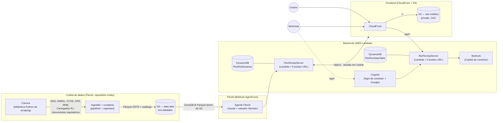
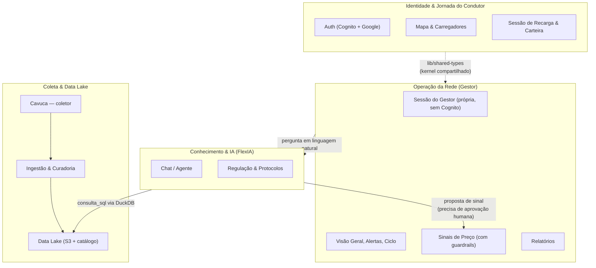
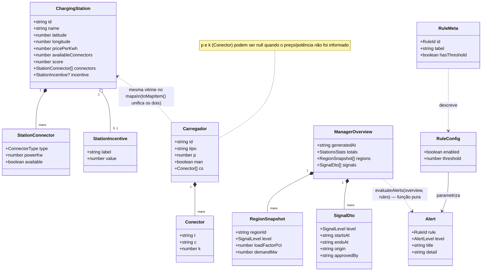
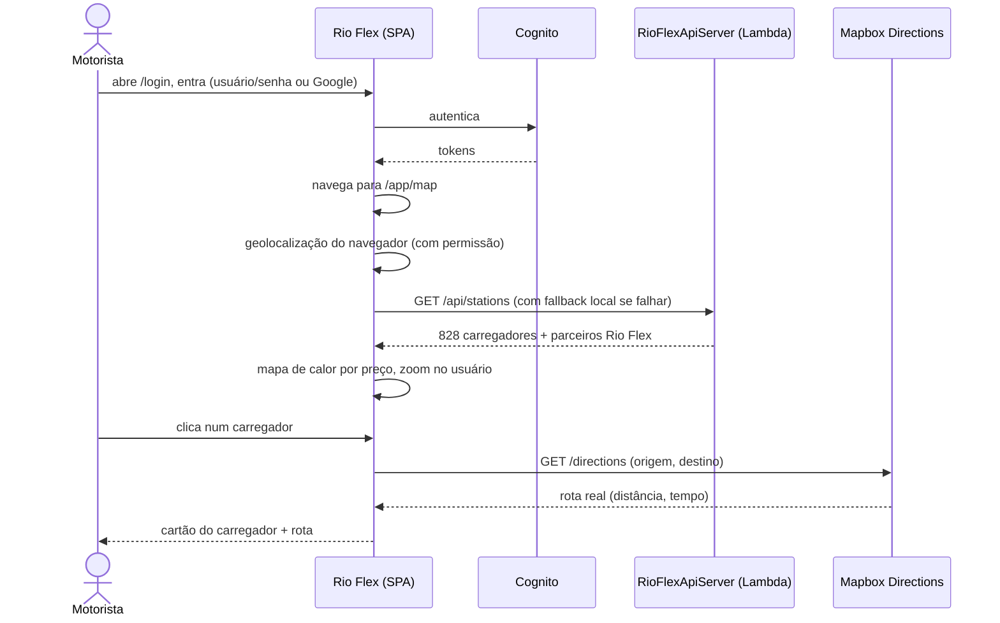
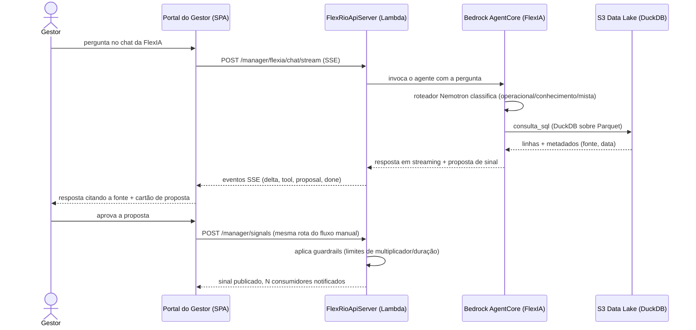
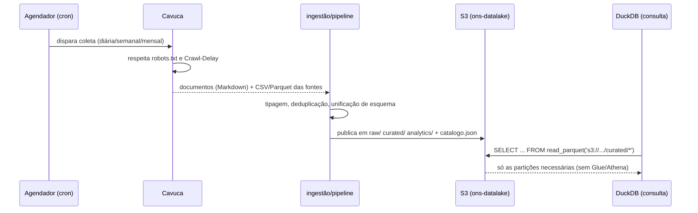

# Rio Flex

**Recarga de veículos elétricos como flexibilidade para a rede.** Um motorista carrega no
carregador certo, pelo preço certo; um gestor de rede enxerga a demanda, publica sinais de preço e
pergunta a uma IA (a **FlexIA**) que responde citando a fonte. Projeto da final do **Hackathon ONS +
UFRJ/COPPE** (Hélio Energy).

- **Site em produção:** https://d2sym3t98n3lcx.cloudfront.net
- **Login do gestor (demonstração):** `gestora@rioflex.dev` / `Gestor@2026`
- **Vídeo de demonstração e roteiro:** [docs/roteiro-video-demo.md](docs/roteiro-video-demo.md)

> Este README documenta a arquitetura, os serviços AWS usados e por quê, a estrutura do
> monorepo e o pipeline de dados que alimenta a FlexIA — incluindo o **Cavuca**, o coletor que
> abastece o data lake no S3. Para o passo a passo de deploy, veja [AWS_DEPLOY.md](AWS_DEPLOY.md).

## Sumário

1. [O que o Rio Flex resolve](#1-o-que-o-rio-flex-resolve)
2. [Arquitetura em um diagrama](#2-arquitetura-em-um-diagrama)
3. [Serviços AWS usados, e por quê](#3-serviços-aws-usados-e-por-quê)
4. [Estrutura do monorepo](#4-estrutura-do-monorepo)
5. [O app do condutor](#5-o-app-do-condutor)
6. [O portal do gestor](#6-o-portal-do-gestor)
7. [FlexIA e o data lake — o papel do Cavuca](#7-flexia-e-o-data-lake--o-papel-do-cavuca)
8. [Infraestrutura como código (CDK)](#8-infraestrutura-como-código-cdk)
9. [Bounded contexts](#9-bounded-contexts)
10. [Diagrama de classes do domínio](#10-diagrama-de-classes-do-domínio)
11. [Diagramas de sequência](#11-diagramas-de-sequência)
12. [SOLID, Clean Code, lint e outras práticas](#12-solid-clean-code-lint-e-outras-práticas)
13. [Rodar localmente](#13-rodar-localmente)
14. [Deploy](#14-deploy)
15. [Fontes de dados e atribuição](#15-fontes-de-dados-e-atribuição)
16. [Limitações conhecidas](#16-limitações-conhecidas)
17. [Outros documentos do repositório](#17-outros-documentos-do-repositório)

---

## 1. O que o Rio Flex resolve

O Brasil desperdiça energia solar e eólica em horários de baixa demanda (37,2 TWh em 2025, segundo
o ONS) enquanto a frota de veículos elétricos cresce sem controle, medição ou inteligência — o que
transforma essa carga em um problema caro para o sistema em vez de uma oportunidade. O Rio Flex
ataca isso por dois lados ao mesmo tempo:

- **Motorista:** um mapa com os carregadores do estado do Rio (preço, potência, rota), que
  recompensa com créditos quem carrega nos horários que aliviam a rede.
- **Gestor da distribuidora/operador:** um painel de operação com alertas, o ciclo completo da
  informação (frota → medidor → distribuidora/orquestrador → FlexIA → consumidor/gestor),
  indicadores de rede, preço e clima, e um agente de IA para consultar dados do setor e propor
  sinais de preço — que só valem depois de aprovados por um humano.

## 2. Arquitetura em um diagrama



Resumo em uma frase por caminho: o **Cavuca** coleta dados públicos → viram **Parquet no S3** →
a **FlexIA** (Bedrock AgentCore) consulta esse lake com **DuckDB** e responde ao gestor →
o **frontend** (CloudFront + S3) fala com dois backends Lambda diferentes, um para o condutor
(Cognito + Bedrock Copilot) e outro para o gestor/FlexIA (sessão própria + DynamoDB).

## 3. Serviços AWS usados, e por quê

| Serviço | Para quê neste projeto | Por que esse serviço |
|---|---|---|
| **Amazon S3** | Guarda o site estático (bucket privado) e o data lake (`ons-datalake-<conta>`, Parquet + catálogo + documentos) | Armazenamento durável e barato; serve como origem do CloudFront e como "banco de dados" analítico consultável direto pelo DuckDB, sem precisar de um serviço de banco |
| **Amazon CloudFront** | CDN na frente do bucket do site — HTTPS, cache, e proxy de `/api/*` para o Lambda do condutor | Sem CloudFront o bucket S3 só serve HTTP simples: sem HTTPS não há login Google/Cognito nem PWA instalável. Substituiu o AWS Amplify Hosting depois que a conta do workshop revelou não ter `amplify:*` na política IAM |
| **AWS Lambda** (2 funções) | `RioFlexApiServer` (API do app do condutor + Cognito + Bedrock Copilot) e `FlexRioApiServer` (API do gestor + ponte para a FlexIA no AgentCore) | Sem servidor para manter, escala a zero, e a conta do workshop não permite EC2/ECS com facilidade — Function URL dá HTTPS nativo sem precisar de API Gateway |
| **Amazon Cognito** | Login e cadastro do condutor, com OAuth do Google opcional | Gerência de identidade gerenciada, com Hosted UI pronta; o portal do gestor **não** usa Cognito — tem login e sessão próprios no backend, propositalmente separados |
| **Amazon DynamoDB** | `FlexRioSessions` (sessão de login do gestor, compartilhada entre execuções do Lambda) e `RioFlexDataTable` (dados do app do condutor) | Pay-per-request, sem servidor, com TTL nativo para expirar sessões sozinho — evita travar o Lambda em concorrência 1 só para manter sessões em SQLite local |
| **Amazon Bedrock** | Modelo do Copilot do app do condutor (`amazon.nova-lite-v1:0` por padrão) | Modelo sob demanda, sem provisionar infraestrutura de inferência |
| **Amazon Bedrock AgentCore** | Runtime do agente **FlexIA** (o "cérebro" do portal do gestor), com Claude para raciocínio e um roteador Nemotron para classificar a pergunta | Runtime gerenciado para agentes com ferramentas (consulta SQL ao lake, busca de documentos, previsão do tempo), implantado a partir do repositório irmão da FlexIA |
| **AWS IAM** | Papéis de execução dos Lambdas com permissão mínima para `bedrock:InvokeModel*` e `bedrock-agentcore:InvokeAgentRuntime` | Cada função só pode chamar o que precisa; a política do participante do workshop também limitou bastante o que o CDK conseguiu provisionar (ver seção 2 do [AWS_DEPLOY.md](AWS_DEPLOY.md)) |
| **AWS CDK** (TypeScript) | Toda a infraestrutura como código, em três stacks independentes (`InfraStack`, `FlexRioStack`, `WebStack`) | Reprodutível e versionado; três stacks separadas evitam um ciclo de dependência no CloudFormation (o Lambda depende do Cognito, o site dependeria do Lambda, e o Cognito precisaria da URL do site — ver seção 6 do AWS_DEPLOY.md) |

Serviços que a conta do workshop **bloqueia** e como isso foi contornado (Glue/Athena, OpenSearch,
RDS, `iam:PassRole` para Lambda com role própria fora do CDK) estão detalhados na seção 12 do
[README da FlexIA](#7-flexia-e-o-data-lake--o-papel-do-cavuca) e na seção 2 do AWS_DEPLOY.md.

## 4. Estrutura do monorepo

```
Rio-Flex/
├── artifacts/
│   ├── rio-flex/            # frontend único (Vite + React) — app do condutor E portal do gestor
│   │   └── src/pages/manager/   # visão geral, alertas, ciclo, rede/preço/clima, sinais, FlexIA,
│   │                             relatórios, regulação, telão — ver seção 6
│   ├── api-server/          # backend Express do app do condutor (Cognito, Bedrock Copilot)
│   │   └── src/lambda.ts        # empacotado para AWS Lambda com @codegenie/serverless-express
│   └── notification-agent/  # microserviço de notificações, usado pelo api-server
├── infra/                   # AWS CDK (TypeScript) — as 3 stacks da seção 8
│   └── lib/{infra,flexrio,web}-stack.ts
├── scripts/
│   ├── build-carregadores-rj.py  # gera o JSON do mapa a partir da coleta do Cavuca (seção 7)
│   ├── prepare-deploy.cjs        # pós-build: rotas estáticas para PWA/S3
│   └── video/                    # tooling do vídeo de demonstração (seção "Outros documentos")
├── docs/
│   └── roteiro-video-demo.md
├── AWS_DEPLOY.md             # runbook de deploy testado, com os problemas reais encontrados
└── JORNADA_DO_USUARIO.md     # histórico de auditoria de UX do app do condutor
```

O gerenciador de pacotes é **pnpm** (workspace), com **TypeScript** em todo o código próprio.
`artifacts/` é o nome histórico da pasta de "pacotes" do workspace (herdado do template original);
não tem relação com artefatos de build.

## 5. O app do condutor

Rotas em `/`, `/login`, `/app/*`. Stack: **Vite + React 18 + TypeScript**, Tailwind (`index.css`),
**Leaflet** com tiles do **Mapbox** (ou CartoDB como alternativa sem token), roteamento com
**wouter**, dados assíncronos com **@tanstack/react-query**.

- **Landing** (`pages/landing`): página inicial com a ilustração animada do ciclo Frota → Carregador
  → Medidor inteligente → Distribuidora/Orquestrador → FlexIA → Consumidor/Gestor
  (`components/viz/EnergyFlow.tsx`) e um veículo elétrico em traço fino carregando
  (`components/viz/HeroEV.tsx`), ambos SVG autoral animado, sem imagens externas.
- **Mapa** (`pages/map`): 828 carregadores do estado do Rio (dados reais coletados pelo Cavuca —
  seção 7), com busca, filtros, clusterização, três modos de mapa de calor (densidade, preço,
  potência) num `canvas` próprio (`components/map/heat-layer.ts`, sem biblioteca de heatmap
  externa), rota real via API de Directions do Mapbox, e zoom automático na localização do usuário
  ao abrir.
- **Carteira, sessão, perfil, onboarding, recibo**: fluxo completo de "carregar → ganhar créditos",
  com fallback local quando a API não responde (o app nunca fica em tela branca por causa da rede).
- **Autenticação:** Amazon Cognito (usuário/senha ou Google), mais um "modo demo" client-side
  (`AuthContext.demoLogin`) que não depende de backend, usado para o botão "Condutor EV".

## 6. O portal do gestor

Rotas em `/gestor/*`, sessão própria (cookie httpOnly, backend `FlexRioApiServer` — **não** usa
Cognito, de propósito, porque o backend de gestão tem seu próprio sistema de login).

| Tela | O que mostra |
|---|---|
| **Visão geral** | KPIs com contagem animada, resumo do dia calculado a partir dos próprios dados, tabela de regiões ordenável/filtrável, favoritos ("minha atenção") |
| **Alertas** | Regras configuráveis (carga alta, preço crítico sem sinal, manutenção, conflitos de preço, dado desatualizado), três níveis, reconhecer/reabrir, histórico de ações |
| **Ciclo** | O diagrama animado do fluxo completo, com os números reais de cada etapa (conectores ocupados, kWh, alertas) |
| **Rede, preço & clima** | Demanda, geração por fonte (hídrica/solar/eólica/térmica/nuclear), previsão de preço por hora, clima |
| **Sinais de preço** | O gestor publica janelas verde/amarelo/vermelho por região, com limites (*guardrails*) de multiplicador e duração |
| **FlexIA** | Chat com o agente de IA (Bedrock AgentCore), resposta em streaming (SSE), citação da ferramenta usada, e propostas de sinal de preço que exigem aprovação explícita antes de publicar |
| **Relatórios** | Modelos prontos + exportação em CSV/PDF, sempre com fonte e data de referência |
| **Regulação & protocolos** | Base de conhecimento (ANEEL, OCPP, PLD/CCEE, normas técnicas) com busca |
| **Telão** | Modo tela cheia com carrossel de regiões, pensado para uma sala de operação |
| **Busca global** (`Ctrl+K`) | Pula para qualquer tela, região, ou já abre a FlexIA com uma pergunta |

Preferências do gestor (favoritos, regras de alerta, histórico de ações) ficam no navegador
(`localStorage`, por usuário) porque o backend ainda não tem armazenamento de preferências —
documentado em cada hook (`lib/manager-store.ts`, `hooks/manager-alerts.ts`).

## 7. FlexIA e o data lake — o papel do Cavuca

A FlexIA e o data lake **não vivem neste repositório** — são o repositório irmão `flexrioTest`
(pasta local `FlexIA`), que implanta o agente no Bedrock AgentCore e publica os dados no S3 que o
Rio Flex consome. Documentando aqui porque é a peça que faz o portal do gestor responder com dados
reais em vez de mock:

```
FlexIA/
├── coleta/        # documentos com o Cavuca: notícias, leis, procedimentos, decisões da ANEEL
├── ingestao/      # bases estruturadas: ONS (bucket oficial), CKAN (ANEEL/CCEE/MME), EPE, clima
├── pipeline/      # inventário → curadoria → publicação → catálogo do acervo da equipe
├── servicos/      # microserviço Cavuca (API HTTP, fila de coleta, agendador)
└── flexia/        # o agente (app/SINAgent) + chat web
```

### O que é o Cavuca

O **[Cavuca](https://github.com/EstevezCodando/Cavuca)** é uma biblioteca Python de raspagem web
(seletores CSS/XPath, requisições HTTP, automação de navegador, crawler, servidor MCP), do mesmo
autor do projeto. A FlexIA o usa como coletor em duas frentes:

1. **Documentos** (`coleta/coletor.py`) — cinco modos (`crawl`, `pagina`, `lista`, `rss`, `tabela`)
   para notícias, leis, procedimentos de rede, resoluções do CNPE e decisões da Diretoria da ANEEL.
   Requisições que imitam navegador, respeito a `robots.txt` e ao `Crawl-Delay`, conversão para
   Markdown que **remove conteúdo oculto usado em prompt injection**, deduplicação por hash do
   texto. Agendado por cron (diário/semanal/mensal) num Code Editor, ou sob demanda pelo
   microserviço Cavuca (`servicos/cavuca`).
2. **O censo de carregadores do estado do Rio** (`carregados_rj`) — 828 locais e 1.422 conectores
   extraídos de `carregados.com.br`, respeitando o `robots.txt` do portal, com no máximo 2-3
   requisições concorrentes e pausa entre elas. É essa coleta que alimenta o **mapa do app do
   condutor** neste repositório: `scripts/build-carregadores-rj.py` lê o CSV publicado pelo Cavuca
   e gera `artifacts/rio-flex/public/data/carregadores-rj.json`, servido estaticamente pelo site.
   Preços vêm de comunidade/operador e **não são confirmados** — o app avisa isso em toda tela que
   mostra preço.

### Do coletor ao S3

`pipeline/04_publicar.py` publica o resultado no bucket `ons-datalake-<conta>` em camadas:

| Prefixo | Conteúdo |
|---|---|
| `raw/` | Arquivos originais únicos (deduplicados por SHA-256) |
| `curated/<tabela>/[ano=AAAA/]` | Parquet ZSTD tipado e unificado, particionado por ano quando grande |
| `analytics/<tabela>/` | Análises derivadas (curtailment, previsão, frota EV, tarifas) |
| `catalogo/catalogo.json` | Tabela → fonte, tema, período, colunas com descrição e unidade |
| `docs/{raw,estado,index}` | Documentos coletados pelo Cavuca, controle de versão, índice de busca |

Hoje o lake tem **112+ tabelas curadas** (ONS, ANEEL, CCEE, EPE, MME, clima) e mais de 34 mil
documentos indexados. A conta do workshop bloqueia Glue/Athena/Lake Formation, então cada tabela do
catálogo vira uma **view do DuckDB sobre o Parquet no S3** (`httpfs`) — sem custo por consulta e
sem serviço intermediário. É essa camada de consulta que o agente FlexIA usa como ferramenta
(`consulta_sql`) quando o gestor pergunta algo no chat.

### O agente

Implantado no **Bedrock AgentCore**; um roteador (**Nemotron Nano**) decide se a pergunta é
operacional (consulta ao lake), de conhecimento (busca em documentos) ou mista, e direciona para
**Claude** responder com a ferramenta certa. Toda resposta cita a fonte e a data de referência —
nunca apresenta um número sem dizer de onde veio. Sinais de preço propostos pela FlexIA **nunca**
são publicados sozinhos: aparecem como proposta na tela do gestor, que aprova ou descarta.

## 8. Infraestrutura como código (CDK)

`infra/` (AWS CDK em TypeScript) define três stacks independentes, propositalmente:

- **`InfraStack`** — Amplify Hosting (legado; mantido por compatibilidade, mas **substituído** pelo
  `WebStack` para o site principal), Cognito, o Lambda `RioFlexApiServer` e o Bedrock Copilot.
- **`FlexRioStack`** — Lambda `FlexRioApiServer` (empacota o build do repositório irmão
  `flexrioTest`), tabela DynamoDB de sessões, permissão para invocar a FlexIA no AgentCore.
- **`WebStack`** — S3 privado (Origin Access Control) + CloudFront para o site, com `/api/*`
  proxiado para a Function URL do `RioFlexApiServer`. Recebe a URL da API por variável de ambiente
  (`RIOFLEX_API_URL`) em vez de referenciar a `InfraStack` diretamente — assim nunca corre o risco
  de redeployar/apagar recursos que hoje divergem do código (Cognito com Google, tabela de dados,
  app Amplify) só porque alguém rodou `cdk deploy` sem querer.

Por que três stacks e não uma? Um `Lambda → Cognito → site → Lambda` numa stack só fecha um ciclo
no CloudFormation. Detalhes de cada armadilha (e como foram resolvidas) estão no
[AWS_DEPLOY.md](AWS_DEPLOY.md).

## 9. Bounded contexts

Não é um monólito por acaso: o portal do gestor propositalmente **não** compartilha autenticação
nem modelo de dados com o app do condutor (seção 6 já explica o porquê da sessão separada). Nomeando
os contextos como o DDD nomearia:



| Contexto | Linguagem ubíqua | Fronteira / anti-corruption layer |
|---|---|---|
| **Identidade & Jornada do Condutor** | posto, conector, sessão de recarga, crédito | `src/api/index.ts` — todo fetch tem fallback para dado local; o resto do app nunca vê a rede falhar |
| **Operação da Rede** | região, sinal, janela verde/amarelo/vermelho, alerta, guardrail | `src/lib/manager-api.ts` — único ponto que fala com o `FlexRioApiServer`; hooks (`hooks/manager-queries.ts`) escondem a URL, os headers e o formato da resposta das telas |
| **Conhecimento & IA** | ferramenta, proposta, fonte, roteamento | O agente nunca escreve direto no domínio de Operação — toda proposta de sinal passa pela mesma rota (`POST /manager/signals`) que o gestor usaria manualmente, com os mesmos guardrails |
| **Coleta & Data Lake** | fonte, snapshot, tabela curada, catálogo | Vive no repositório irmão `flexrioTest`; a única costura com este repositório é o arquivo estático gerado por `scripts/build-carregadores-rj.py` e a Function URL do `FlexRioApiServer` |

O **kernel compartilhado** é pequeno de propósito: `lib/shared-types` (tipos usados tanto pelo
frontend quanto pelo `api-server`, como `ChargingStation`) — o portal do gestor tem seus próprios
tipos (`types/manager.ts`) e **não** reaproveita os do condutor, porque são domínios diferentes que
só por acaso vivem no mesmo pacote de frontend.

## 10. Diagrama de classes do domínio



`evaluateAlerts` (`lib/alerts.ts`) é uma função pura — recebe `ManagerOverview` + `Rules`, devolve
`Alert[]` — sem tocar em rede, `localStorage` ou React; isso é o que faz ela ser testável sem montar
componente nenhum.

## 11. Diagramas de sequência

### a) Condutor: entrar, achar um carregador e traçar rota



### b) Gestor pergunta à FlexIA e publica um sinal



### c) Coleta batch: do Cavuca ao data lake (offline, fora deste repositório)



## 12. SOLID, Clean Code, lint e outras práticas

### SOLID, com exemplo real de cada letra

- **S — Single Responsibility.** `lib/alerts.ts` só decide *quais* alertas existem (função pura);
  `hooks/manager-alerts.ts` só cuida de *estado e persistência* (acks, log, regras no
  `localStorage`); `pages/manager/Alerts.tsx` só cuida de *apresentação*. Trocar a regra de negócio
  não toca a tela; trocar o layout não toca a regra.
- **O — Open/Closed.** Alertas são guiados por dados: `RULE_META` (`lib/alerts.ts`) é uma lista de
  configuração — adicionar uma regra nova é adicionar um item na lista, não editar um `if/else` em
  cascata. O mesmo padrão aparece nos modos do mapa (`MODES` em `pages/map/index.tsx`) e nas abas
  da página inicial (`TABS` em `pages/landing/index.tsx`).
- **L — Liskov Substitution.** `ChargerMap` (`components/map/ChargerMap.tsx`) recebe uma lista de
  `MapItem` — tanto os 828 carregadores reais quanto os postos "parceiro Rio Flex" (dado de
  demonstração, convertido por `toMapItem()`) implementam o mesmo formato e são tratados de forma
  idêntica pelo componente, sem `if (isPartner)` espalhado pelo código de renderização.
- **I — Interface Segregation.** Em vez de um hook `useManager()` monolítico, cada tela usa só o
  que precisa: `useManagerMeta`, `usePriceForecast`, `useManagerNotifications`
  (`hooks/manager-queries.ts`) — cada um com sua própria chave de cache e intervalo de
  atualização.
- **D — Dependency Inversion.** As telas dependem da *forma* dos dados (o tipo de retorno do hook),
  não de como eles chegam. `lib/manager-api.ts` e `src/api/index.ts` são os únicos módulos que
  sabem que existe `fetch`, cookie, header `X-Requested-With` ou *Server-Sent Events* — trocar o
  transporte não exige tocar em nenhuma página.

### Clean Code aplicado

- **Funções pequenas e nomeadas pela intenção:** `makePriceScale`, `evaluateAlerts`, `priceText`,
  `distKm` (`lib/carregadores.ts`, `lib/alerts.ts`) — cada uma faz uma coisa, e o nome já responde
  "o quê"; os comentários no código respondem só o "porquê" (ex.: por que a escala de preço dos
  parceiros é calculada separada da geral, em `ChargerMap.tsx`).
- **Nenhuma tela trava em branco:** todo hook que busca dado tem estado de carregando (`Skeleton`),
  vazio (`EmptyState` com próximo passo) e erro (`ErrorPanel` com "tentar de novo" e detalhe técnico
  recolhido) — ver `components/manager/kit.tsx`. `src/api/index.ts` nunca propaga uma falha de rede
  para a tela: sempre cai num dado local plausível.
- **Sem número mágico solto:** formatação de moeda, data e número fica só em `lib/format.ts`
  (pt-BR, `Intl`-consistente); cores de estado (verde/âmbar/vermelho) são constantes nomeadas
  (`ALERT_COLOR`, `LEVEL_COLOR`), nunca uma string de cor repetida pelo código.
- **Acessibilidade como parte do componente, não um extra:** `aria-live`, `aria-pressed`,
  `aria-label` nos botões de ação, foco visível (`:focus-visible`) e respeito a
  `prefers-reduced-motion` em toda animação (`components/manager/kit.tsx`,
  `components/viz/EnergyFlow.tsx`).

### Lint, formatação e tipos

- **TypeScript em modo estrito** (`tsconfig.base.json`: `strictNullChecks`, `noImplicitAny`,
  `noFallthroughCasesInSwitch`, `useUnknownInCatchVariables`) em todos os pacotes do workspace,
  checado com `pnpm run typecheck` (roda em cada pacote via *project references*).
- **Prettier** para formatação consistente (dependência na raiz do workspace).
- **ESLint ainda não está configurado neste workspace** — hoje o único portão automatizado é o
  compilador TypeScript estrito. É a lacuna mais honesta deste projeto: o próximo passo natural é
  `@typescript-eslint` + `eslint-plugin-react-hooks` no pacote `rio-flex`, para pegar o que o `tsc`
  não pega (hooks fora de ordem, imports não usados, etc.).
- **Testes de infraestrutura de verdade:** `infra/test/infra.test.ts` substitui o placeholder
  comentado do `cdk init` por asserções reais sobre os templates do CloudFormation gerados (o
  bucket do site é privado, `/api/*` tem seu próprio *behavior* apontando para a Function URL
  recebida por parâmetro, o timeout e a política IAM do Lambda da FlexIA são os esperados) — rodam
  com `pnpm --filter infra test`.

### Outras práticas

- **Infraestrutura como código com fronteiras deliberadas** (seção 8): três stacks CDK menores,
  cada uma sem saber demais sobre a outra, em vez de uma stack gigante — o mesmo princípio de
  responsabilidade única aplicado à infraestrutura.
- **Segurança por padrão:** cookies de sessão `httpOnly`, cabeçalho `X-Requested-With` como defesa
  simples contra CSRF em requisições cross-origin, papéis IAM com a ação mínima necessária (seção
  3), nenhum segredo commitado (`.env` fora do git, credenciais nunca em texto claro no template
  do CloudFormation — ver seção 10 do AWS_DEPLOY.md sobre a limitação conhecida do token do
  GitHub).
- **Dados reproduzíveis, não copiados à mão:** tanto a base de carregadores do mapa quanto o vídeo
  de demonstração (seção 17) têm um script que os regera a partir da fonte — nada foi editado à
  mão depois de gerado.

## 13. Rodar localmente

```bash
pnpm install
pnpm run dev          # sobe api-server (porta 5000) + rio-flex (porta 3000) em paralelo
# ou, separadamente:
pnpm run dev:api
pnpm run dev:front
```

Sem variáveis de ambiente, o frontend usa dados de exemplo locais (`src/data/*.ts`) e cai de volta
neles sempre que uma chamada de API falha — nunca trava numa tela em branco. Para testar contra os
backends reais na AWS, defina `VITE_API_BASE_URL` (app do condutor) e/ou `VITE_MANAGER_API_URL`
(portal do gestor) antes do build; veja `artifacts/rio-flex/.env.example` (se existir) ou as
Function URLs nos outputs do CDK.

Para gerar (ou atualizar) a base de carregadores do mapa a partir de uma nova coleta do Cavuca:

```bash
python scripts/build-carregadores-rj.py [pasta/com/os/csv/do/cavuca]
```

## 14. Deploy

O passo a passo completo, testado de verdade (incluindo os problemas reais encontrados e como
foram resolvidos), está em **[AWS_DEPLOY.md](AWS_DEPLOY.md)**. Resumo:

```powershell
# 1. Build do bundle Lambda da API do condutor + do frontend
pnpm --filter @workspace/api-server run build:lambda
$env:VITE_MANAGER_API_URL = "<Function URL do FlexRioApiServer>"
$env:VITE_MAPBOX_TOKEN    = "<token público pk.*>"
pnpm --filter @workspace/rio-flex run build

# 2. Site (S3 + CloudFront) — independente das outras stacks
cd infra
$env:RIOFLEX_API_URL = "<Function URL do RioFlexApiServer>"
npx cdk deploy WebStack --require-approval never
```

## 15. Fontes de dados e atribuição

| Fonte | O que fornece |
|---|---|
| **ONS** (Dados Abertos) | Geração, carga, CMO/PLD, curtailment, disponibilidade — bucket oficial `s3://ons-aws-prod-opendata` |
| **ANEEL** (portal CKAN) | Geração distribuída, DEC/FEC, componentes tarifárias, SIGET, SAMP, curva de carga |
| **CCEE** | PLD horário/diário/semanal, contratos, garantia física |
| **EPE** | Consumo por região/UF/classe, PDE 2035 |
| **MME** | Luz para Todos, REIDI |
| **Open-Meteo / ERA5** | Clima observado e previsão |
| **Carregados** (`carregados.com.br`) | Censo de carregadores do estado do Rio — coletado pelo Cavuca em 22/09/2026; **não é censo universal nem confirma operação real** |

## 16. Limitações conhecidas

- Preços de carregadores no mapa são informados por comunidade/operador e **não confirmados**.
- Preferências do portal do gestor (favoritos, regras de alerta) ficam no navegador, não no
  backend — cada dispositivo/navegador tem as suas.
- O código de `infra/lib/infra-stack.ts` **diverge** do que está de fato implantado na conta AWS
  (o Cognito com Google, a tabela de dados e o app Amplify em produção foram criados/ajustados
  direto ou por versões anteriores do código) — `cdk diff` antes de qualquer `cdk deploy
  InfraStack` é obrigatório; veja a seção 7-B do AWS_DEPLOY.md.
- FlexIA e o pipeline de dados vivem no repositório irmão `flexrioTest`; este repositório só
  consome a Function URL já implantada.
- Contas de demonstração (`DEMO_ACCOUNTS=true`) existem só para apresentação; nunca usar em
  produção real sem trocar as senhas padrão.

## 17. Outros documentos do repositório

- **[AWS_DEPLOY.md](AWS_DEPLOY.md)** — runbook de deploy linha a linha, com cada erro real
  encontrado e a solução.
- **[docs/roteiro-video-demo.md](docs/roteiro-video-demo.md)** — roteiro cena a cena do vídeo de
  demonstração, e como regravá-lo (`scripts/video/`).
- **[JORNADA_DO_USUARIO.md](JORNADA_DO_USUARIO.md)** — auditoria histórica da UX do app do
  condutor (contexto de por que certas telas existem).
